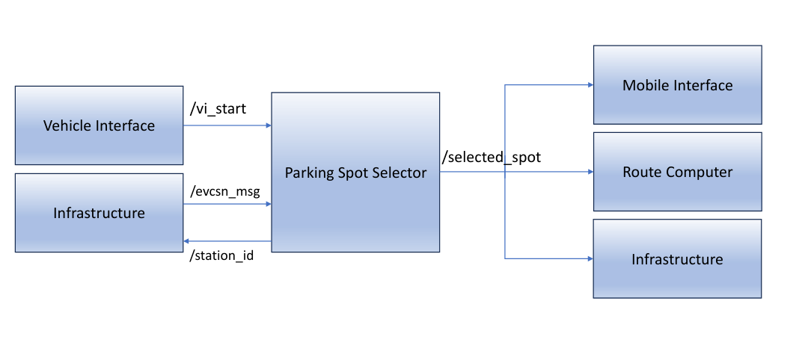
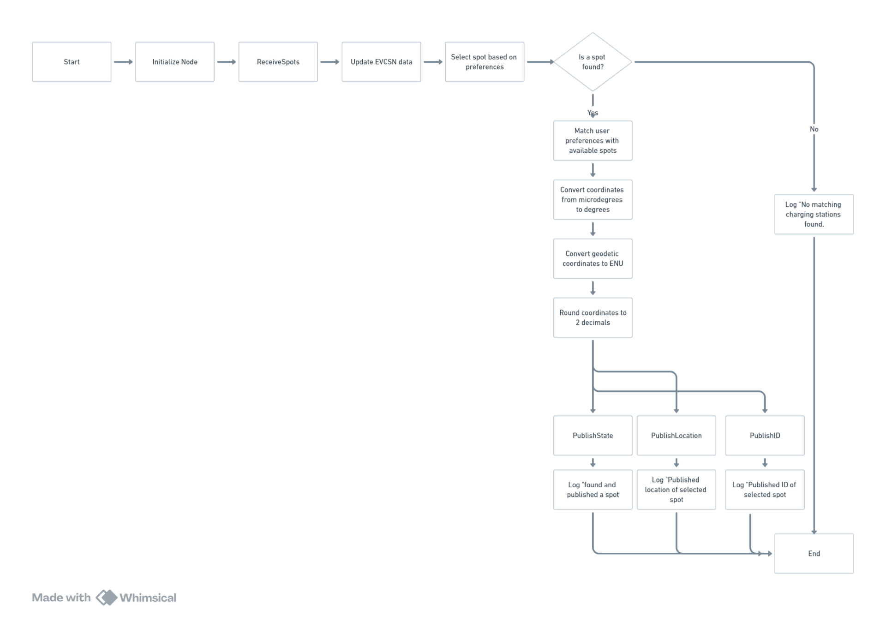

# AV Parking Spot Selector (ROS 2 / V2X-Enabled)
### Intelligent Parking / Charging Spot Selection for Autonomous Vehicles with Full V2X Integration
**By Ibrahim Al Dabbagh — Robotics & Perception Engineer**

<p align="center"></p>

---

# 🔍 Overview

The **AV Parking Spot Selector** is a ROS 2 (Python) module that selects the **most suitable parking or charging spot** for an autonomous vehicle within a controlled indoor model-city environment.  
It integrates:
- V2X EVCSN messages  
- Vehicle preference modes  
- ENU ↔ Geodetic conversion  
- Dynamic filtering  
- Real-time occupancy & accessibility  
- Full ROS 2 interoperability  

The selected spot is published for the **AV Global Route Planner**, enabling autonomous navigation toward the chosen parking/charging station.

---

# 🎥 Demo — Full Selection Cycle

<p align="center">
  
</p>

---

# ✅ Key Capabilities

- Full V2X integration  
- Dynamic multi-criteria filtering  
- ENU coordinate generation  
- Dual output topics (Option A & B)  
- Preference-driven selection  
- Tested with unit + integration tests  
- Compatible with the AV Route Planner  

---

# 🧭 System Architecture

<p align="center"></p>

---

# 🛰 RQT Graph

<p align="center"></p>

---

# 🧩 ROS 2 Interfaces

### Subscriptions
| Topic | Type | Description |
|---|---|---|
| `/evcsn_msg` | EVCSN | Incoming V2X messages |
| `/vi_start` | Int32 | User preference |
| `/loc_pose` | PoseStamped | Ego vehicle ENU pose |

### Publications
| Topic | Type | Description |
|---|---|---|
| `/selected_spot` | PoseStamped | Final ENU parking/charging spot |
| `/station_id` | Int32 | ID of chosen station |

---

# 📍 Parking Layout

<p align="center"></p>

---

# ⚡ V2X Message Definitions (Full)

## 1. EVCSN  
- its_header  
- stationdata[]  

## 2. EVChargingStationData  
- charging_station_id  
- accessibility  
- reference_position  
- charging_spot_available  
- cost  
- connector_type  
- status  
- operator_id  
- power_kw  

## 3. ReferencePosition  
- latitude  
- longitude  
- altitude  
- confidence ellipse  

---

# 🔄 Spot Selection Algorithm

<p align="center"></p>

Steps:
1. Receive EVCSN  
2. Parse stations  
3. Filter by availability  
4. Filter by accessibility  
5. Apply user preference  
6. Convert to ENU  
7. Compute ranking  
8. Publish selection  

---

# 🖥 Runtime Output

<p align="center"></p>

---

# ✅ Detailed Functionality

- V2X EVCSN parsing  
- Station eligibility logic  
- ENU coordinate generation  
- Distance-based ranking  
- Multi-preference selection  
- Publishing final ENU spot  

---

# 🧪 Tests (Unit & Integration)

Included:
- test_spot_finder.py  
- test_spot_finder_un.py  
- test_spot_finder_integration.py  

Tests ensure:
- Message parsing  
- Filtering logic  
- ENU conversion  
- Topic publishing behavior  

---

# ⚙️ Build & Run

```bash
cd ~/ros2_ws/src
git clone <repo_url> AV_Parking_Spot_Selector
cd ~/ros2_ws
colcon build --symlink-install --packages-select adapt_spotsl
source install/setup.bash
```

Run:
```bash
ros2 run adapt_spotsl spotsl
```

---

# 👤 Author

**Ibrahim Al Dabbagh**  
Robotics & Perception Engineer
> ⚠️ **Portfolio — Proprietary Notice**
> 
> This repository is part of my personal portfolio — **viewing only**.  
> Do **not** copy, fork, modify, reuse, or redistribute any files without written permission.  
> © 2025 Ibrahim Aldabbagh — **All rights reserved.**
